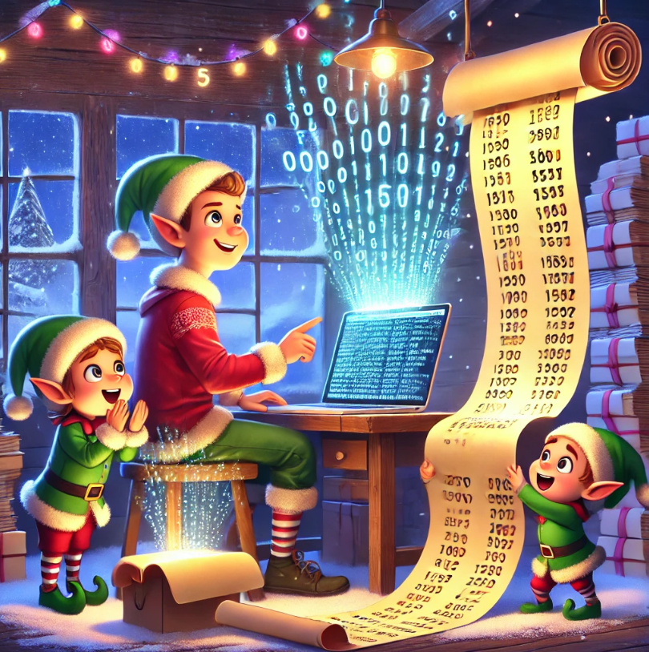

# Chapter 1 - Historian Hysteria



In the enchanted land of the North Pole, the Chief Historian has mysteriously vanished while exploring historically significant sites known only by unique location IDs. A team of Senior Elvish Historians discovers his scattered notes but ends up with two mismatched lists of these magical locations. To solve this festive puzzle, they seek the aid of a talented coder.

The coder reads parses the two mitchmatched lists into integer vectors:

```rust
let mut first_numbers: Vec<i32> = Vec::new();
let mut second_numbers: Vec<i32> = Vec::new();

contents
    .lines()
    .for_each(|line| {
        let parts: Vec<u32> = line
            .split("   ")
            .filter_map(|s| s.trim().parse().ok())
            .collect();
        first_numbers.push(parts[0] as i32);
        second_numbers.push(parts[1] as i32);
    });
```

With the list compiled in to efficient data-structures, he can sort them in the right order and then calculate the total distance between them by pairing numbers and summing their differences, arriving at **1,341,714**:

```rust
let mut sorted_first_numbers: Vec<i32> = first_numbers.clone();
let mut sorted_second_numbers: Vec<i32> = second_numbers.clone();

sorted_first_numbers.sort();
sorted_second_numbers.sort();

let mut day11: i32 = 0;
for i in 0..sorted_first_numbers.len() {
    day11 = day11 + (sorted_first_numbers[i] - sorted_second_numbers[i]).abs();
}
```
Sensing more Christmas magic at play, he notices many IDs appear in both lists. And the elves tell him that he needs to computes a similarity score by multiplying each number in the left list by its occurrences in the right list, totaling **27,384,707**:

```rust
let mut similarity: i32 = 0;
for i in 0..first_numbers.len() 
{
    let current_number: i32 = 
        first_numbers[i];

    let frequencies: i32 = 
        second_numbers
        .iter()
        .filter(|&n| 
            *n == current_number)
        .count() as i32;

    similarity = 
        similarity + 
        (frequencies * current_number);
}
```

With the lists harmonized, the path to finding the Chief Historian becomes clear. 

The elves cheer! 

And the North Pole's festive spirit is rekindled, and all know that Christmas will be merrier thanks to the coder's clever problem-solving.
