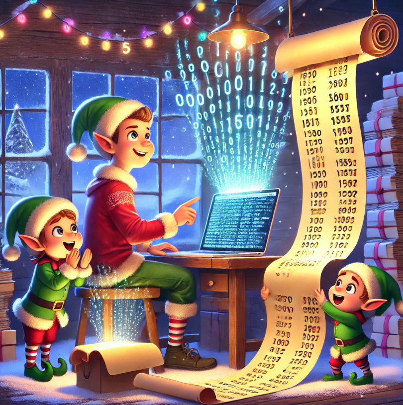

# Chapter 1 - Historian Hysteria

In the enchanted land of the North Pole, the Chief Historian has mysteriously vanished while exploring historically significant sites known only by unique location IDs. A team of Senior Elvish Historians discovers his scattered notes but ends up with two mismatched lists of these magical locations. To solve this festive puzzle, they seek the aid of a talented coder.

Embracing the spirit of Christmas, the coder sets out to reconcile the lists. Using his skills, he calculates the total distance between them by pairing numbers and summing their differences, arriving at **1,341,714**. Sensing more Christmas magic at play, he notices many IDs appear in both lists. He then computes a similarity score by multiplying each number in the left list by its occurrences in the right list, totaling **27,384,707**.

With the lists harmonized, the path to finding the Chief Historian becomes clear. The elves cheer, the North Pole's festive spirit is rekindled, and all know that Christmas will be merrier thanks to the coder's clever problem-solving.

# Chapter 2 - Red-Nosed Reports

In the enchanting realm of the North Pole, the coder accompanies the Senior Elvish Historians to the Red-Nosed Reindeer nuclear fusion/fission plant in search of the missing Chief Historian. Though they find no trace of him, the plant's engineers eagerly approach the coder. They reminisce about the time Rudolph was saved through molecular synthesis from a single electron—a legendary feat.

Seizing the moment, the engineers ask for help analyzing some unusual data from the Red-Nosed reactor. While the historians scour every nook of the facility, the coder agrees to assist. The data consists of numerous reports, each a list of magical energy levels. A report is considered safe if the levels are all increasing or decreasing, with each adjacent level differing by one to three.

Applying his analytical prowess, the coder determines that **624** reports are safe.

Later, the engineers recall the Problem Dampener—a device that allows the reactor to tolerate a single bad level in an otherwise safe report. With this in mind, the coder revises his analysis. By considering reports that can be made safe by removing one level, he finds that **658** reports are now safe.

Thanks to the coder's expertise, the engineers rejoice, knowing the reactor is secure. The festive spirit glows brighter, and the quest to find the Chief Historian continues with renewed hope.